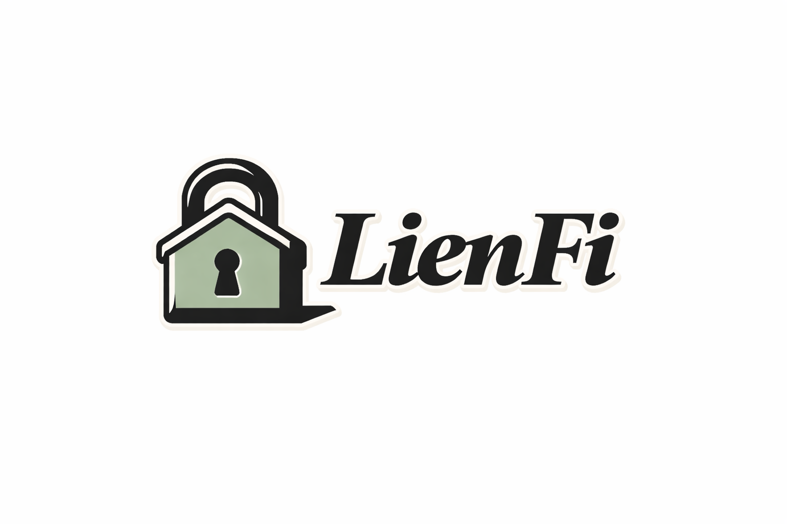

<p align="center">
  
</p>

<h1 align="center">LienFi</h1>
<p align="center"><i>Trustless Mortgages with Private Credit Scoring & Sealed-Bid Liquidation</i></p>

<p align="center">
  A complete on-chain mortgage system where credit data is assessed privately inside a confidential enclave (never touches the chain), property collateral is locked as privacy-preserving NFTs, lenders earn passive yield, and loan defaults trigger sealed-bid Vickrey auctions where bid amounts, bidder identities, and losing bids are never exposed on-chain.
</p>

<p align="center">
  <a href="#"></a>
  <a href="#"></a>
  <a href="#"></a>
  <a href="#"></a>
  <a href="#"></a>
</p>

<p align="center">
  <a href="#-the-problem">Problem</a> &bull;
  <a href="#-how-lienfi-works">How It Works</a> &bull;
  <a href="#-system-flow">System Flow</a> &bull;
  <a href="#-privacy-guarantees">Privacy</a> &bull;
  <a href="#-smart-contracts">Contracts</a> &bull;
  <a href="#-chainlink-services-used">Chainlink</a> &bull;
  <a href="#-tech-stack">Tech Stack</a> &bull;
  <a href="#-quick-start">Quick Start</a>
</p>

---

## The Problem

DeFi lending today requires **overcollateralization** because protocols have no way to assess real-world creditworthiness without exposing private financial data on-chain. Traditional on-chain auctions are fully transparent — bid amounts, bidder identities, and losing bids are permanently visible. Together these two gaps make a trustless mortgage impossible.

**No existing protocol solves both simultaneously:**

| Gap | Why It Matters |
|-----|---------------|
| **No private credit scoring** | Borrowers must reveal income, bank history, and debt ratios publicly — or protocols skip underwriting entirely and demand 150%+ collateral |
| **Transparent liquidation auctions** | Bid amounts are public (competitors snipe), bidder identities are exposed (privacy leak), losing bidders are visible (reputational risk) |
| **No property data privacy** | Tokenized real estate exposes street addresses, appraisal values, and owner identities on-chain forever |
| **Sybil-vulnerable auctions** | A single entity can create hundreds of wallets to manipulate liquidation outcomes |

For tokenized real estate worth hundreds of thousands, these aren't inconveniences — they're dealbreakers.

---

## How LienFi Works

LienFi is a complete mortgage primitive with no step requiring a bank, appraiser, or court:

> *Lenders fund a USDC pool. Borrowers prove creditworthiness privately. Property NFT locked as collateral. Monthly EMI repayments grow pool yield. Default triggers sealed-bid auction to recover funds.*

### The Lifecycle

| Phase | What Happens | Privacy |
|-------|-------------|---------|
| **A. Pool Funding** | Lenders deposit USDC, receive clUSDC receipt tokens. Exchange rate rises as EMIs accumulate — passive yield, no staking. | clUSDC balances public |
| **B. Property NFT** | Borrower verifies property via CRE enclave. Only a `commitmentHash` goes on-chain — no address, no value, no metadata. | Full details enclave-only |
| **C. Credit Assessment** | Borrower submits loan request hash on-chain. CRE auto-triggers: Plaid data fetch, metric extraction, hard rule gates, Gemini AI scoring. Raw data discarded after. | Financial data never on-chain |
| **D. Loan Disbursement** | Approved borrower locks PropertyNFT as collateral. USDC disbursed from pool. Loan record created on-chain. | Approval visible, financials hidden |
| **E. Monthly Repayment** | Borrower pays fixed EMI. Full amount enters pool, raising clUSDC exchange rate. On full repayment, NFT returned. | EMI schedule public |
| **F. Default + Auction** | 3 missed payments trigger default. PropertyNFT transferred to LienFiAuction. Sanitized listing (no address, no "default" label). Sealed bids via CRE. Vickrey settlement. Winner gets NFT + full address reveal. | Bids, bidders, losing bids all hidden |

### Key Features

- **Private Credit Scoring** — Plaid bank data fetched inside CRE enclave, pre-processed into metrics, scored by Gemini AI. Raw financial data is discarded after assessment — never persisted, never on-chain.
- **Privacy-Preserving Property NFTs** — ERC-721 with only a commitment hash on-chain. No tokenURI, no metadata. Full details stored exclusively in the CRE enclave.
- **Passive Yield for Lenders** — clUSDC exchange rate model (same as Compound cTokens). Pool USDC grows as EMIs come in, each clUSDC redeems for more. No staking, no claiming.
- **Sealed-Bid Vickrey Auctions** — Bid amounts exist only inside the CRE enclave. On-chain: only opaque bid hashes. Winner pays second-highest price. Losing bids and bidders are never revealed.
- **World ID Sybil Resistance** — On-chain ZK proof verification. One human, one deposit. No fake accounts manipulating auctions.
- **Event-Driven Assessment Pipeline** — `LoanRequestSubmitted` event auto-triggers the entire credit assessment. No manual CRE trigger, no separate oracle — one coherent system.
- **Sanitized Listings** — Default auctions show property type, neighborhood, size — but never the street address, owner identity, or reason for sale. Winner gets full details post-settlement only.

---

## System Flow

```
                                    LIENFI

 PHASE A: POOL FUNDING
 ──────────────────────────────────────────────────────────────────
  Lender
    |  deposit(USDC)
    v
  LendingPool ──── mint clUSDC ──> Lender
    |
    |  exchangeRate = poolUSDC / clUSDC.totalSupply()
    |  (rate rises as EMIs accumulate -> lenders earn yield passively)


 PHASE B: PROPERTY NFT MINTING
 ──────────────────────────────────────────────────────────────────
  Borrower --> POST /verify-property (propertyId, docs)
                    |
                    v
              API (enclave)
                    |  stores full details internally (never on-chain)
                    |  computes commitmentHash = keccak256(addr+value+docs+secret)
                    |  returns { tokenId, commitmentHash }
                    |
  Borrower --> LoanManager.mintPropertyNFT(commitmentHash)
                    |
                    v
              PropertyNFT ──── tokenId + commitmentHash stored on-chain
                               (no metadata, no address, no value visible)


 PHASE C: LOAN REQUEST + CREDIT ASSESSMENT (EVENT-DRIVEN)
 ──────────────────────────────────────────────────────────────────
  Borrower
    |
    |-(1)-> POST /loanRequest { plaidToken, tokenId, amount, tenure }
    |              |
    |              v
    |         API stores details, returns requestHash
    |
    |-(2)-> LoanManager.submitRequest(requestHash)
    |              |
    |              |  emits LoanRequestSubmitted(borrower, requestHash)
    |              |
    |              v
    |      +------------------------------------------------------------+
    |      |        CRE ENCLAVE (auto-triggered by event)               |
    |      |                                                            |
    |      |  1. Fetch details from API DB using requestHash            |
    |      |  2. Recompute + verify hash (abort if mismatch)            |
    |      |  3. Get appraisedValue from enclave store (tokenId)        |
    |      |  4. Compute EMI = P*r*(1+r)^n / ((1+r)^n - 1)             |
    |      |  5. Fetch Plaid data via Confidential HTTP                 |
    |      |  6. Pre-process: income, DTI, stability, overdraft rate    |
    |      |  7. Hard gates: LTV<=80%, coverage>=3x, no recent defaults |
    |      |  8. Pass metrics (NOT raw data) to Gemini                  |
    |      |  9. Gemini returns: creditScore, verdict, approvedAmount   |
    |      |  10. Discard all raw financial data                        |
    |      |  11. Write verdict via KeystoneForwarder                   |
    |      +------------------------------------------------------------+
    |              |
    |              v
    |      LoanManager._writeVerdict()
    |              |-- APPROVED -> store pendingApprovals[borrower]
    |              |-- REJECTED -> emit LoanRequestRejected


 PHASE D: LOAN DISBURSEMENT
 ──────────────────────────────────────────────────────────────────
  Borrower --> LoanManager.borrow(tokenId, amount, tenure)
                    |
                    |  check pendingApprovals[borrower] exists + not expired
                    |  verify amount <= approvedLimit
                    |  check LendingPool.availableLiquidity() >= amount
                    |
                    |-> PropertyNFT.transferFrom(borrower -> LoanManager)
                    |   (collateral locked)
                    |
                    |-> LendingPool.disburse(borrower, amount)
                    |        |
                    |        --> USDC transferred to borrower wallet
                    |
                    --> Loan record created on-chain
                              { loanId, emiAmount, nextDueDate, status:ACTIVE }


 PHASE E: MONTHLY REPAYMENT
 ──────────────────────────────────────────────────────────────────
  Borrower --> LoanManager.repay(loanId)  [every 30 days]
                    |
                    |  accept exactly emiAmount USDC
                    |  reduce remainingPrincipal
                    |
                    --> LendingPool.repayEMI(emiAmount)
                              |
                              --> pool USDC balance grows
                                        |
                                        --> clUSDC exchange rate rises
                                                  |
                                                  --> lenders earn yield passively

  On full repayment:
    PropertyNFT returned to borrower --> Loan closed


 PHASE F: DEFAULT + SEALED-BID LIQUIDATION
 ──────────────────────────────────────────────────────────────────
  Anyone --> LoanManager.checkDefault(loanId)  [keeper/cron]
                    |
                    |  miss 1 -> emit PaymentMissed (warning)
                    |  miss 2 -> emit PaymentMissed (grace period)
                    |  miss 3 -> _triggerDefault()
                    |                |
                    |                v
                    |       loan.status = DEFAULTED
                    |       PropertyNFT -> LienFiAuction
                    |       LienFiAuction.initiateDefaultAuction(
                    |           tokenId, reservePrice=remainingPrincipal)
                    |
                    v
      +------------------------------------------------------------+
      |  CRE ENCLAVE (listing generation)                          |
      |                                                            |
      |  Retrieve full property details (tokenId -> enclave store) |
      |  Generate sanitized listing:                               |
      |    + property type, size, year built                       |
      |    + city + neighborhood (NOT street address)              |
      |    + verified appraisal value + reserve price              |
      |    - no street address, no owner identity, no "default"    |
      |  Compute listingHash, store on-chain in Auction struct     |
      +------------------------------------------------------------+
                    |
                    v
  Bidders view sanitized listing
                    |
  Bidder --> depositToPool(USDC, lockUntil) + World ID ZK proof
  Bidder --> POST /bid { auctionId, amount, signature } via CRE
                    |
                    v  (Confidential HTTP -- bid stays private)
      +------------------------------------------------------------+
      |  CRE Bid Workflow                                          |
      |    validate EIP-712 signature                              |
      |    check pool balance >= bid amount                        |
      |    store bid encrypted in enclave                          |
      |    return opaque bidHash                                   |
      +------------------------------------------------------------+
                    |
                    --> LienFiAuction: only bidHash stored on-chain
                          (bid amount invisible to all observers)

  [auction deadline passes]
                    |
      +------------------------------------------------------------+
      |  CRE Settlement Workflow (cron-triggered)                  |
      |    retrieve all bids from enclave                          |
      |    Vickrey: winner = highest bid                           |
      |             price  = second-highest bid (or reserve)       |
      |    all losing bids discarded -- never revealed             |
      +------------------------------------------------------------+
                    |
                    v
      LienFiAuction._settleAuction(winner, price)
                    |
                    |-> PropertyNFT transferred to winner
                    |
                    --> LoanManager.onAuctionSettled(loanId, proceeds)
                              |
                              |-- proceeds >= debt -> full repayment to pool
                              |                       surplus -> borrower
                              |-- proceeds < debt  -> partial repayment to pool
                                                      shortfall absorbed by pool

  Winner --> POST /reveal/:auctionId (signed request)
                    |
                    --> CRE returns full street address + ownership docs
                          (Confidential HTTP -- winner only, post-settlement)


 PRIVACY BOUNDARY SUMMARY
 ──────────────────────────────────────────────────────────────────
  PRIVATE (CRE enclave only)          ON-CHAIN (public)
  ----------------------------        --------------------------------
  Plaid financial data                Credit verdict (approve/reject + limit)
  Credit score + Gemini reasoning     requestHash (meaningless without preimage)
  Property address + documents        commitmentHash (unreadable fingerprint)
  Appraisal details                   Loan record (no financial details)
  Bid amounts + bidder identities     EMI schedule + payment history
  Vickrey settlement logic            Opaque bid hashes only
  Full listing details (pre-reveal)   Winner + settlement price
                                      clUSDC balances + exchange rate
```

---

## System Participants

| Actor | Role |
|-------|------|
| **Lender / Investor** | Deposits USDC into lending pool, earns yield via clUSDC exchange rate appreciation |
| **Borrower** | Verifies property, applies for loan, locks PropertyNFT as collateral, repays monthly EMIs |
| **CRE Enclave** | Confidential compute — credit assessment (Plaid + Gemini), property data custodian, auction listing generator, bid/settlement engine |
| **LoanManager** | Core contract — owns the full mortgage lifecycle from origination through repayment to liquidation |
| **LendingPool** | Holds USDC, disburses loans, receives EMI repayments, manages clUSDC exchange rate |
| **PropertyNFT** | ERC-721 — one token per property, commitment hash only, no metadata on-chain |
| **LienFiAuction** | Sealed-bid Vickrey auction for defaulted properties — deposit pool, World ID, opaque bid hashes |

---

## Privacy Guarantees

| Information | On-Chain Visibility | Who Sees It |
|-------------|-------------------|-------------|
| Borrower financials (income, bank data) | **Never** | Nobody — discarded after assessment |
| Credit score / Gemini reasoning | **Never** | Nobody — discarded after assessment |
| Loan request details | requestHash only | Nobody (hash is meaningless without pre-image) |
| Property address + ownership docs | **Never** | Winner only — post-settlement via CRE |
| Property appraisal value | Via sanitized listing | Public (neighborhood-level only during auction) |
| Bid amounts | **Never** | Nobody — only hashes on-chain |
| Losing bidder identities | **Never** | Nobody |
| Reason for auction | **Never** | Nobody — no "default" or "foreclosure" label |
| Approval verdict | Approve / reject + limit | On-chain (public) |
| EMI schedule + payment history | On-chain | Public |
| clUSDC balances + exchange rate | On-chain | Public |

**Additional privacy layers:**
- Multi-token obfuscation — USDC deposits carry no auction reference, observers can't link deposits to specific auctions
- API credentials decrypted only inside CRE enclave — never exposed to any party
- Settlement responses AES-GCM encrypted before leaving enclave
- World ID ZK proofs — identity verified without revealing who you are
- PropertyNFT has no `tokenURI` — zero on-chain metadata leakage

---

## Smart Contracts

| Contract | Purpose |
|----------|---------|
| **LienFiAuction.sol** | Core auction + deposit pool + World ID sybil resistance + opaque bid hash storage + Vickrey settlement via CRE |
| **LienFiRWAToken.sol** | ERC-20 RWA token with restricted minting (to be replaced by PropertyNFT) |
| **MockWorldIDRouter.sol** | Always-passing World ID mock for testing |
| **MockUSDC.sol** | Test USDC token (6 decimals) with public mint |
| **ReceiverTemplate.sol** | Abstract base for receiving Keystone CRE DON-signed reports |
| **LoanManager.sol** | Full mortgage lifecycle — request anchoring, CRE verdict receiver, loan origination, repayment tracking, default triggering, auction settlement callback |
| **LendingPool.sol** | USDC pool — lender deposits, loan disbursement, EMI collection. Access-controlled by LoanManager |
| **clUSDC.sol** | ERC-20 receipt token. Minted on deposit, burned on withdrawal. Exchange rate appreciates as pool USDC grows |
| **PropertyNFT.sol** | ERC-721 — one token per property, stores only `commitmentHash`. No tokenURI, no on-chain metadata |

### Architecture Decisions

| Decision | Rationale |
|----------|-----------|
| ERC-721 (not ERC-20) for property | One token per property, no fractions needed |
| No metadata on-chain | Property details in CRE enclave only — commitment hash as tamper-proof anchor |
| clUSDC exchange rate model | No per-lender yield tracking needed — pool USDC grows as EMIs come in, rate rises automatically (same as Compound cTokens) |
| LoanManager owns all loan state | No separate oracle contract — approval verdict and loan lifecycle in one contract |
| requestHash as DB key + on-chain anchor | Single value proves request integrity; DB lookup key off-chain, tamper check on-chain |
| Event-driven CRE trigger | `LoanRequestSubmitted` event auto-triggers assessment — one coherent system, no manual step |
| EMI computed in enclave | Used for income coverage gate check; stored in approval; read at disbursement — no recomputation |

---

## Chainlink Services Used

| Service | Usage | Files |
|---------|-------|-------|
| **CRE Workflow Engine** | 4 workflows orchestrating the entire system — credit assessment, bid collection, auction creation, Vickrey settlement | [`bid-workflow/main.ts`](cre-workflows/bid-workflow/main.ts) · [`create-auction-workflow/main.ts`](cre-workflows/create-auction-workflow/main.ts) · [`credit-assessment-workflow/main.ts`](cre-workflows/credit-assessment-workflow/main.ts) · [`settlement-workflow/main.ts`](cre-workflows/settlement-workflow/main.ts) |
| **Confidential HTTP** | Plaid bank data fetch and Groq AI scoring inside the enclave — raw data never leaves | [`credit-assessment-workflow/main.ts`](cre-workflows/credit-assessment-workflow/main.ts) |
| **Vault DON Secrets** | API keys (Plaid, Groq, bid API) and AES encryption key stored securely, decrypted only inside enclave | [`cre-workflows/.env.example`](cre-workflows/.env.example) · [`secrets.yaml`](cre-workflows/secrets.yaml) |
| **Encrypted Output** | AES-GCM encryption of settlement results and credit verdicts before leaving enclave | [`settlement-workflow/main.ts`](cre-workflows/settlement-workflow/main.ts) · [`credit-assessment-workflow/main.ts`](cre-workflows/credit-assessment-workflow/main.ts) |
| **Log-Based Trigger** | `LoanRequestSubmitted` event auto-triggers credit assessment — no manual step | [`credit-assessment-workflow/workflow.yaml`](cre-workflows/credit-assessment-workflow/workflow.yaml) · [`LoanManager.sol`](contracts/src/LoanManager.sol) |
| **Cron Trigger** | Settlement workflow polls every 30 seconds for expired auctions | [`settlement-workflow/workflow.yaml`](cre-workflows/settlement-workflow/workflow.yaml) · [`create-auction-workflow/workflow.yaml`](cre-workflows/create-auction-workflow/workflow.yaml) |
| **EVM Read** | On-chain state reads (loan status, auction data, pool balances) inside workflows | [`bid-workflow/main.ts`](cre-workflows/bid-workflow/main.ts) · [`settlement-workflow/main.ts`](cre-workflows/settlement-workflow/main.ts) · [`create-auction-workflow/main.ts`](cre-workflows/create-auction-workflow/main.ts) |
| **EVM Write (KeystoneForwarder)** | DON-signed report submission delivering credit verdicts, bid hashes, and settlement results on-chain | [`LoanManager.sol`](contracts/src/LoanManager.sol) · [`LienFiAuction.sol`](contracts/src/LienFiAuction.sol) · [`ReceiverTemplate.sol`](contracts/src/ReceiverTemplate.sol) · [`IReceiver.sol`](contracts/src/interfaces/IReceiver.sol) |
| **CRE Project Config** | RPC endpoints and staging/production target settings | [`project.yaml`](cre-workflows/project.yaml) · [`bid-workflow/config.staging.json`](cre-workflows/bid-workflow/config.staging.json) · [`credit-assessment-workflow/config.staging.json`](cre-workflows/credit-assessment-workflow/config.staging.json) · [`create-auction-workflow/config.staging.json`](cre-workflows/create-auction-workflow/config.staging.json) · [`settlement-workflow/config.staging.json`](cre-workflows/settlement-workflow/config.staging.json) |

---

## Tech Stack

| Layer | Technology | Purpose |
|-------|-----------|---------|
| **Smart Contracts** | Solidity 0.8.24 + Foundry | LoanManager, LendingPool, LienFiAuction, PropertyNFT, clUSDC |
| **Contract Libraries** | OpenZeppelin | ERC-20, ERC-721, Ownable, ReentrancyGuard |
| **Identity** | World ID (Worldcoin) | On-chain ZK proof verification, sybil resistance |
| **Confidential Compute** | Chainlink CRE | 5 workflows — mint, bid, settle, credit assessment, listing |
| **Credit Data** | Plaid API (Sandbox) | Bank account data, transaction history, income verification |
| **AI Scoring** | Google Gemini | Credit scoring from pre-processed financial metrics |
| **Network** | Ethereum Sepolia | Testnet deployment |
| **Private API** | Express.js + TypeScript | Bid storage, EIP-712 verification, Vickrey logic, loan request storage, property data custodian |
| **Signature Standard** | EIP-712 | Typed structured data for bid signing and identity verification |
| **Encryption** | AES-GCM | Settlement and credit verdict encryption in enclave |

---

## Quick Start

### Prerequisites

- [Foundry](https://book.getfoundry.sh/getting-started/installation) (`foundryup`)
- [CRE CLI](https://docs.chain.link/cre/getting-started/cli-installation) + authenticated (`cre auth login`)
- Node.js 20+ and Bun
- Sepolia ETH for gas
- [Plaid](https://dashboard.plaid.com/) sandbox credentials
- [Groq](https://console.groq.com/) API key (used by credit assessment workflow)

### 1. Clone

```bash
git clone https://github.com/yourusername/lienfi.git
cd lienfi
```

### 2. Smart Contracts

Contracts are already deployed — see [Deployed Contracts](#deployed-contracts-sepolia) above. Only needed if redeploying:

```bash
cd contracts
forge install
# Edit foundry.toml or set env vars: PRIVATE_KEY, SEPOLIA_RPC_URL

forge script script/DeployLienFi.s.sol:DeployLienFi \
  --rpc-url "$SEPOLIA_RPC_URL" --broadcast
```

### 3. Private API

```bash
cd api
npm install
cp .env.example .env
```

Edit `api/.env`:

```env
PORT=3001
BID_API_KEY=<openssl rand -hex 32>
VERIFYING_CONTRACT=0x<LienFiAuction-address>
USDC_ADDRESS=0x<MockUSDC-address>
CHAIN_ID=11155111
RPC_URL=https://eth-sepolia.g.alchemy.com/v2/YOUR_KEY
MONGODB_URI=<mongodb connection string>
```

```bash
npm run dev     # dev server with hot reload (tsx watch)
npm run build   # compile to dist/
npm start       # run compiled build
# API running at http://localhost:3001
```

### 4. CRE Workflows

```bash
cd cre-workflows
cp .env.example .env
```

Edit `cre-workflows/.env`:

```env
CRE_ETH_PRIVATE_KEY=0x<your-sepolia-private-key>
CRE_TARGET=staging-settings
MY_API_KEY_ALL=<same as BID_API_KEY above>
AES_KEY_ALL=<openssl rand -hex 32>
GROQ_API_KEY_ALL=<from console.groq.com>
PLAID_SECRET_ALL=<plaid sandbox secret>
PLAID_CLIENT_ID_ALL=<plaid client id>
```

Install dependencies in each workflow:

```bash
cd bid-workflow && bun install && cd ..
cd create-auction-workflow && bun install && cd ..
cd credit-assessment-workflow && bun install && cd ..
cd settlement-workflow && bun install && cd ..
```

Simulate a workflow locally (example: bid):

```bash
cre workflow simulate ./bid-workflow \
  --target staging-settings \
  --http-payload @bid-payload.json \
  --non-interactive --trigger-index 0
```

### 5. Frontend

```bash
cd frontend
npm install
```

Create `frontend/.env.local`:

```env
NEXT_PUBLIC_PRIVY_APP_ID=<from privy.io dashboard>
NEXT_PUBLIC_ALCHEMY_API_KEY=<from alchemy.com>
NEXT_PUBLIC_PLAID_ACCESS_TOKEN=<plaid sandbox access token>
```

```bash
npm run dev     # http://localhost:3000
npm run build   # production build
```

### 6. Demo Script

```bash
cd demo
npm install
cp .env.example .env
# Edit demo/.env — see Running the Demo section below

npm run demo          # run all phases A → F3
npm run demo:fresh    # clear checkpoint and start over
npm run demo:from -- e  # resume from a specific phase
```

---

## End-to-End Flow

```
 1.  Lender deposits USDC          -> receives clUSDC at current exchange rate
 2.  Borrower verifies property     -> CRE computes commitmentHash, stores details in enclave
 3.  Borrower mints PropertyNFT    -> tokenId + commitmentHash on-chain, no metadata
 4.  Borrower POSTs loan details   -> stored in DB keyed by requestHash, receives requestHash
 5.  Borrower calls submitRequest  -> requestHash anchored on-chain, LoanRequestSubmitted emitted
 6.  CRE auto-triggered by event   -> fetches DB, verifies hash, Plaid -> Gemini -> verdict on-chain
 7.  Borrower calls borrow()       -> approval checked, NFT locked, USDC disbursed from pool
 8.  Borrower repays monthly       -> full EMI enters pool, clUSDC exchange rate rises
 9.  3 missed payments             -> checkDefault() called, NFT to auction, default triggered
10.  Sanitized listing published   -> neighborhood-level details + listingHash on-chain
11.  Bidders participate           -> USDC deposited, signed bids via CRE, hashes on-chain only
12.  Auction settles               -> Vickrey in enclave, winner + price on-chain, pool repaid
13.  Winner requests reveal        -> signed request, CRE returns full address via Confidential HTTP
```

---

## What's Already Built

The full LienFi system is implemented and deployed on Sepolia across two environments (frontend + demo script):

**Smart Contracts**

| Contract | Description | Status |
|----------|-------------|--------|
| `LienFiAuction.sol` | Deposit pool, World ID sybil resistance, opaque bid hashes, Vickrey settlement | Deployed |
| `LoanManager.sol` | Full mortgage lifecycle — loan origination, CRE verdict receiver, repayment tracking, default triggering, auction settlement callback | Deployed |
| `LendingPool.sol` | USDC pool — lender deposits, loan disbursement, EMI collection | Deployed |
| `clUSDC.sol` | Receipt token with appreciating exchange rate (Compound cToken model) | Deployed |
| `PropertyNFT.sol` | ERC-721 — commitment hash only, no on-chain metadata | Deployed |
| `MockUSDC.sol` | 6-decimal test USDC with public mint | Deployed |

**CRE Workflows**

| Workflow | Trigger | Description | Status |
|----------|---------|-------------|--------|
| `credit-assessment-workflow` | Log (`LoanRequestSubmitted`) | Plaid bank data fetch → metric extraction → Gemini AI scoring → on-chain verdict | Deployed |
| `create-auction-workflow` | HTTP | Default detection, sanitized listing generation, auction creation on-chain | Deployed |
| `bid-workflow` | HTTP | EIP-712 bid validation, encrypted bid storage in enclave, opaque hash on-chain | Deployed |
| `settlement-workflow` | Cron (30s) | Vickrey settlement after auction deadline — winner + second-price on-chain | Deployed |

**Private API** (Render)

| Endpoint | Description | Status |
|----------|-------------|--------|
| `POST /loanRequest` | Store loan request details, return `requestHash` | Live |
| `POST /verify-property` | Property verification, compute + store `commitmentHash` | Live |
| `POST /bid` | EIP-712 validation + encrypted bid storage | Live |
| `GET /listing/:auctionId` | Sanitized auction listing (no address, no owner) | Live |
| `POST /reveal/:auctionId` | Winner-only full property address reveal | Live |
| `POST /settle` | Trigger Vickrey settlement | Live |
| `GET /status/:auctionId` | Auction status and bid count | Live |

**Frontend** — Next.js dashboard with Privy wallet auth, pool deposit/withdraw, borrow flow, live auction view, and CRE workflow log viewer. Deployed on Vercel.

**Demo Script** — Single-command `tsx` orchestrator that runs the full A→F3 lifecycle end-to-end on Sepolia with checkpoint/resume support.

---

## Deployed Contracts (Sepolia)

The system has two separate deployments — one for the frontend demo with longer time windows for realistic UX, and one for the end-to-end demo script with compressed timings for fast iteration.

### Frontend Deployment

> EMI period: **2 minutes** · Auction duration: **10 minutes**

| Contract | Address |
|----------|---------|
| MockUSDC | [`0x3Ef3f81b24ACB7334C75EAA38a2C132c8eA74656`](https://sepolia.etherscan.io/address/0x3Ef3f81b24ACB7334C75EAA38a2C132c8eA74656) |
| clUSDC | [`0x40Eb4B08D1Bf9b9dbF0CD5C1825f9507c7484F9E`](https://sepolia.etherscan.io/address/0x40Eb4B08D1Bf9b9dbF0CD5C1825f9507c7484F9E) |
| LendingPool | [`0xa2E797b58489B849c8A47413197BC1db2EeEBbD4`](https://sepolia.etherscan.io/address/0xa2E797b58489B849c8A47413197BC1db2EeEBbD4) |
| LoanManager | [`0x901e8969F1368A58dbBa84813147e086E2B006DD`](https://sepolia.etherscan.io/address/0x901e8969F1368A58dbBa84813147e086E2B006DD) |
| PropertyNFT | [`0x10e39BcF7c1148FA62d90D40cCFc40D1Bf9F0F35`](https://sepolia.etherscan.io/address/0x10e39BcF7c1148FA62d90D40cCFc40D1Bf9F0F35) |
| LienFiAuction | [`0x5f69cbcf902Fd3F01dFD6F297b94C7D779a7544E`](https://sepolia.etherscan.io/address/0x5f69cbcf902Fd3F01dFD6F297b94C7D779a7544E) |

### Demo Script Deployment

> EMI period: **1 minute** · Auction duration: **5 minutes**

| Contract | Address |
|----------|---------|
| MockUSDC | [`0xFa5B0cF5301C6263Df3F39624984BC9aE918faA3`](https://sepolia.etherscan.io/address/0xFa5B0cF5301C6263Df3F39624984BC9aE918faA3) |
| clUSDC | [`0x9eCf84eC8EB63BCFD9DD3B487D6935d9Cc319019`](https://sepolia.etherscan.io/address/0x9eCf84eC8EB63BCFD9DD3B487D6935d9Cc319019) |
| LendingPool | [`0x87BcBc638d700bb91b36B8607cB4d22dcD4c8A61`](https://sepolia.etherscan.io/address/0x87BcBc638d700bb91b36B8607cB4d22dcD4c8A61) |
| LoanManager | [`0x11B0a5D5B1A922a46C17C21Fb4cb6A8559C3076F`](https://sepolia.etherscan.io/address/0x11B0a5D5B1A922a46C17C21Fb4cb6A8559C3076F) |
| PropertyNFT | [`0x30D49451E729756627A085a9ee0bc2A0eE2F2806`](https://sepolia.etherscan.io/address/0x30D49451E729756627A085a9ee0bc2A0eE2F2806) |
| LienFiAuction | [`0xffE7cE1f9C1624c6419FDd9E9d3A57d95E36DAa6`](https://sepolia.etherscan.io/address/0xffE7cE1f9C1624c6419FDd9E9d3A57d95E36DAa6) |

---

## Project Structure

```
lienfi/
├── contracts/                           # Solidity smart contracts (Foundry)
│   ├── src/
│   │   ├── LienFiAuction.sol           # Auction: deposit pool + World ID + sealed bids + Vickrey
│   │   ├── LienFiRWAToken.sol          # ERC-20 RWA token (legacy)
│   │   ├── LoanManager.sol             # Full mortgage lifecycle + CRE verdict receiver
│   │   ├── LendingPool.sol             # USDC pool — disburse, EMI collection
│   │   ├── clUSDC.sol                  # Receipt token with appreciating exchange rate
│   │   ├── PropertyNFT.sol             # ERC-721 — commitment hash only, no on-chain metadata
│   │   ├── ReceiverTemplate.sol        # Abstract base for Keystone CRE DON-signed reports
│   │   ├── interfaces/
│   │   │   ├── ILendingPool.sol
│   │   │   ├── ILienFiAuction.sol
│   │   │   ├── ILienFiRWAToken.sol
│   │   │   ├── ILoanManager.sol
│   │   │   ├── IPropertyNFT.sol
│   │   │   ├── IReceiver.sol
│   │   │   └── IWorldID.sol
│   │   ├── libraries/
│   │   │   └── ByteHasher.sol          # World ID field hashing
│   │   └── mocks/
│   │       ├── MockWorldIDRouter.sol   # Always-pass World ID for testing
│   │       └── MockUSDC.sol            # 6-decimal test USDC
│   ├── script/
│   │   └── DeployLienFi.s.sol         # Full deployment + wiring script
│   └── foundry.toml
├── api/                                 # Private API (Express.js + TypeScript)
│   └── src/
│       ├── server.ts
│       ├── routes/
│       │   ├── bid.ts                  # POST /bid — EIP-712 validation + bid storage
│       │   ├── bidHash.ts              # GET /bidHash/:auctionId/:bidder — retrieve bid hash
│       │   ├── listing.ts              # GET /listing/:auctionId — sanitized auction listing
│       │   ├── listingHash.ts          # GET /listingHash/:auctionId — listing hash lookup
│       │   ├── loanRequest.ts          # POST /loanRequest — store request details, return hash
│       │   ├── pendingBid.ts           # GET /pendingBid/:auctionId — pending bid status
│       │   ├── reveal.ts               # POST /reveal/:auctionId — winner-only address reveal
│       │   ├── settle.ts               # POST /settle — trigger Vickrey settlement
│       │   ├── status.ts               # GET /status/:auctionId — auction status
│       │   ├── verifyProperty.ts       # POST /verify-property — property verification + commitment hash
│       │   └── workflowLogs.ts         # GET /workflow-logs — CRE workflow execution logs
│       └── lib/
│           ├── auth.ts                 # API key middleware
│           ├── chain.ts                # On-chain state reads (viem)
│           ├── db.ts                   # Persistent storage layer
│           ├── eip712.ts               # EIP-712 signature verification
│           ├── store.ts                # In-memory bid + loan request + property store
│           └── vickrey.ts              # Second-price auction settlement logic
├── cre-workflows/                       # Chainlink CRE Workflows
│   ├── project.yaml                    # CRE project settings (RPC URLs, chains)
│   ├── secrets.yaml                    # Vault DON secret mappings
│   ├── abis/                           # Contract ABIs consumed by workflows
│   │   ├── LienFiAuctionABI.json
│   │   └── LoanManagerABI.json
│   ├── bid-workflow/                   # Sealed bid collection (HTTP trigger)
│   ├── create-auction-workflow/        # Default detection + auction creation (HTTP trigger)
│   ├── credit-assessment-workflow/     # Plaid + Gemini credit scoring (log trigger)
│   ├── settlement-workflow/            # Vickrey settlement (cron trigger)
│   └── generate-bid-payload.ts         # Helper: generate EIP-712 signed test bids
├── frontend/                            # Next.js dashboard (Privy + wagmi)
│   └── src/
│       ├── app/
│       │   ├── auctions/               # Auction listing + detail pages
│       │   ├── borrow/                 # Borrower loan application flow
│       │   ├── pool/                   # Lender deposit + clUSDC stats
│       │   └── workflows/              # CRE workflow execution log viewer
│       ├── components/
│       │   ├── charts/                 # Exchange rate + pool composition charts
│       │   ├── layout/                 # Sidebar, TopNav, BottomDock
│       │   └── ui/                     # Shared UI primitives (shadcn-style)
│       ├── config/                     # Contract addresses, Privy, wagmi config
│       ├── hooks/                      # useAuction, useLoan, usePool, useTokenBalances
│       └── lib/                        # API client, tx history, notifications
├── demo/                                # End-to-end demo orchestrator (tsx)
│   └── src/
│       ├── main.ts                     # CLI entry — arg parsing, startup checks, phase runner
│       ├── config.ts                   # Env var loading + defaults
│       ├── clients.ts                  # viem wallet/public clients per actor
│       ├── abis.ts                     # Contract ABIs
│       ├── logger.ts                   # Chalk-coloured per-phase logger
│       ├── checkpoint.ts               # Phase checkpoint read/write
│       ├── cre.ts                      # CRE CLI wrapper (spawn + capture)
│       ├── utils.ts                    # poll, sleep, format helpers
│       └── phases/
│           ├── a-pool-funding.ts
│           ├── b-property-mint.ts
│           ├── c-credit-assessment.ts
│           ├── d-loan-disbursement.ts
│           ├── e-repayment.ts
│           ├── f1-default-auction.ts
│           ├── f2-sealed-bidding.ts
│           └── f3-settlement.ts
├── assets/                              # Logo, banner, diagrams
└── README.md
```

---

## Credit Assessment Pipeline

The credit assessment is the core innovation — a fully private underwriting flow inside Chainlink CRE:

```
Borrower                    API                         CRE Enclave
   |                         |                              |
   |-- POST /loanRequest --->|                              |
   |   {plaidToken, tokenId, |                              |
   |    amount, tenure}      |                              |
   |                         |-- store details,             |
   |                         |   compute requestHash        |
   |<-- { requestHash } -----|                              |
   |                         |                              |
   |-- submitRequest(hash) --|------ on-chain tx ---------> |
   |   (LoanManager)         |                              |
   |                         |   LoanRequestSubmitted event |
   |                         |                              |
   |                         |<-- fetch by requestHash -----|
   |                         |-- return details ----------->|
   |                         |                              |
   |                         |   1. Verify hash matches     |
   |                         |   2. Get appraised value     |
   |                         |   3. Compute EMI             |
   |                         |                              |
   |                         |<-- Plaid API (Conf. HTTP) ---|
   |                         |-- bank data ---------------->|
   |                         |                              |
   |                         |   4. Extract metrics:        |
   |                         |      income, DTI, stability  |
   |                         |   5. Hard gates:             |
   |                         |      LTV <= 80%              |
   |                         |      coverage >= 3x          |
   |                         |      no recent defaults      |
   |                         |                              |
   |                         |<-- Gemini (Conf. HTTP) ------|
   |                         |-- metrics only ------------->|
   |                         |                              |
   |                         |   6. creditScore, verdict,   |
   |                         |      approvedAmount          |
   |                         |   7. DISCARD all raw data    |
   |                         |                              |
   |                         |   8. Write verdict on-chain  |
   |                         |      via KeystoneForwarder   |
   |                         |                              |
   |<---- LoanRequestApproved / LoanRequestRejected -------|
```

---

## Running the Demo

The demo script runs the full LienFi lifecycle end-to-end on Sepolia: pool funding → property mint → credit assessment → loan disbursement → repayment → default detection → sealed-bid auction → Vickrey settlement.

### Prerequisites

- Node.js 20+
- [CRE CLI](https://docs.chain.link/cre/getting-started/cli-installation)
- 4 Sepolia wallets funded with ~0.05 ETH each (lender, borrower, bidder A, bidder B)
- [Plaid](https://dashboard.plaid.com/) sandbox credentials (free signup)

### 1. Set up the demo environment

```bash
cd demo
npm install
cp .env.example .env
```

Edit `demo/.env` — the following are **pre-configured** and ready to use:

| Variable | Value |
|----------|-------|
| `RPC_URL` | `https://ethereum-sepolia-rpc.publicnode.com` |
| `API_URL` | `https://lienfi.onrender.com` |
| `API_KEY` | `33ab8800ae775f6b302118a9f9811bf77d4633450ee690e27afcd2eb4a33cc25` |
| `MOCK_USDC_ADDRESS` | `0xFa5B0cF5301C6263Df3F39624984BC9aE918faA3` |
| `LENDING_POOL_ADDRESS` | `0x87BcBc638d700bb91b36B8607cB4d22dcD4c8A61` |
| `LOAN_MANAGER_ADDRESS` | `0x11B0a5D5B1A922a46C17C21Fb4cb6A8559C3076F` |
| `PROPERTY_NFT_ADDRESS` | `0x30D49451E729756627A085a9ee0bc2A0eE2F2806` |
| `LIENFI_AUCTION_ADDRESS` | `0xffE7cE1f9C1624c6419FDd9E9d3A57d95E36DAa6` |
| `CL_USDC_ADDRESS` | `0x9eCf84eC8EB63BCFD9DD3B487D6935d9Cc319019` |

You **must** set these yourself:

| Variable | How to get it |
|----------|---------------|
| `LENDER_PRIVATE_KEY` | Sepolia wallet private key (0x-prefixed, 64 hex chars) |
| `BORROWER_PRIVATE_KEY` | Different Sepolia wallet |
| `BIDDER_A_PRIVATE_KEY` | Different Sepolia wallet |
| `BIDDER_B_PRIVATE_KEY` | Different Sepolia wallet |
| `PLAID_CLIENT_ID` | From [Plaid Dashboard](https://dashboard.plaid.com/) (sandbox) |
| `PLAID_SECRET` | From Plaid Dashboard (sandbox secret) |

### 2. Set up the CRE workflow environment

The demo invokes CRE workflows for credit assessment, bid submission, default detection, and settlement. You need to configure the CRE environment:

```bash
cd cre-workflows
cp .env.example .env
```

Edit `cre-workflows/.env` — the API key is **pre-configured**:

```env
MY_API_KEY_ALL=33ab8800ae775f6b302118a9f9811bf77d4633450ee690e27afcd2eb4a33cc25
```

You **must** set these yourself:

| Variable | How to get it |
|----------|---------------|
| `CRE_ETH_PRIVATE_KEY` | Sepolia wallet private key used by CRE workflows to sign and submit on-chain transactions |
| `AES_KEY_ALL` | 32-byte hex AES-GCM encryption key (`openssl rand -hex 32`) |
| `GROQ_API_KEY_ALL` | From [Groq Console](https://console.groq.com/) |
| `PLAID_SECRET_ALL` | Same Plaid sandbox secret as demo |
| `PLAID_CLIENT_ID_ALL` | Same Plaid client ID as demo |

### 3. Run the demo

```bash
cd demo

# Run all phases (A through F3)
npm run demo

# Start fresh (clear checkpoint and run from the beginning)
npm run demo:fresh

# Resume from a specific phase
npm run demo:from -- e

# Run a single phase
npx tsx src/main.ts --phase f2
```

> **First run?** Use `npm run demo:fresh` to ensure a clean start.

The demo uses a checkpoint file (`demo/checkpoint.json`) to track progress. If a phase fails, fix the issue and re-run — it will resume from where it left off. Use `npm run demo:fresh` to clear the checkpoint and start over.

### Demo Phases

| Phase | Description | Duration |
|-------|------------|----------|
| **A** | Pool Funding — lender deposits USDC, receives clUSDC | ~30s |
| **B** | Property Mint — borrower verifies property, mints NFT | ~30s |
| **C** | Credit Assessment — loan request → CRE → Plaid + AI scoring | ~2min |
| **D** | Loan Disbursement — NFT locked, USDC disbursed | ~30s |
| **E** | Repayment + Default — 1 EMI paid, then wait for default detection | ~8min |
| **F1** | Default Auction — CRE detects default, creates auction | ~1min |
| **F2** | Sealed Bidding — two bidders deposit + submit sealed bids | ~2min |
| **F3** | Vickrey Settlement — CRE settles auction, winner gets NFT | ~1min |

> See [`demo/sample-output.txt`](demo/sample-output.txt) for a full example of what the demo output looks like.

---

## Team

Built by the **LienFi Team** for the Chainlink Convergence Hackathon.

---

## License

MIT License — see [LICENSE](./LICENSE) for details.

---

<p align="center">
  
</p>

<p align="center">
  <i>Built for the Chainlink Convergence Hackathon 2025</i><br/>
  <i>Powered by <a href="https://chain.link">Chainlink CRE</a> &bull; Credit via <a href="https://plaid.com">Plaid</a> + <a href="https://ai.google.dev">Gemini</a> &bull; Identity via <a href="https://worldcoin.org">World ID</a> &bull; Deployed on <a href="https://sepolia.etherscan.io">Sepolia</a></i>
</p>
